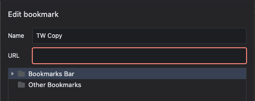

# tw-copy

This repository houses a Javascript bookmarklet to make it easier to copy [Tripwire](https://tripwire.eve-apps.com/?system=Thera) signature data into [Thera Scan](https://therascan.info).

## Usage

To get started, copy the following code to your clipboard by clicking on the copy icon in the top-right of the code block:

```javascript
javascript:(function(){
    var t = "";
    function formatSignature(id) {
        if (!id) return "???-###";
        return [
            id.substring(0, 3).toUpperCase(),
            id.substring(3, 6) || "###"
        ].join("-")
    }
    function systemName(id) {
        return tripwire.systems[id]?.name || tripwire.aSigSystems[id]
    }
    document.querySelectorAll("#sigTable tbody tr").forEach((el) => {
        const s0 = tripwire.client.signatures[el.dataset.id];
        const csv = [];
        csv.push(formatSignature(s0.signatureID), s0.type);
        if ("wormhole" === s0.type) {
            const wh = Object.values(tripwire.client.wormholes).find((wh) => {
                return (wh.initialID == s0.id || wh.secondaryID == s0.id);
            });
            const s1 = tripwire.client.signatures[(s0.id == wh.initialID)
                ? wh.secondaryID
                : wh.initialID
            ];
            csv.push(wh.type || "null");
            csv.push(systemName(s0.systemID), systemName(s1.systemID));
            csv.push(wh.life, wh.mass);
        } else {
            csv.push(s0.name);
        }
        csv.push(s0.createdByName, s0.lifeTime, s0.lifeLength, s0.lifeLeft, s0.modifiedByName, s0.modifiedTime);
        t += csv.join(options.signatures.copySeparator) + "\r\n";
    });
    navigator.permissions.query({name: "clipboard-write"}).then(result => {
        if (result.state == "granted" || result.state == "prompt") {
            navigator.clipboard.writeText(t);
        }
    });
})();
```

Next, right-click in your Chrome bookmark bar and select `Add Page...`. In the popup that opens, add your own name, and paste the copied javascript code into the `URL` field.



Open up [Tripwire](https://tripwire.eve-apps.com/?system=Thera) and click your new bookmark to copy all of the existing signatures to your clipboard.

These can be pasted directly into the `Import Signatures` area of [Thera Scan](https://therascan.info).
